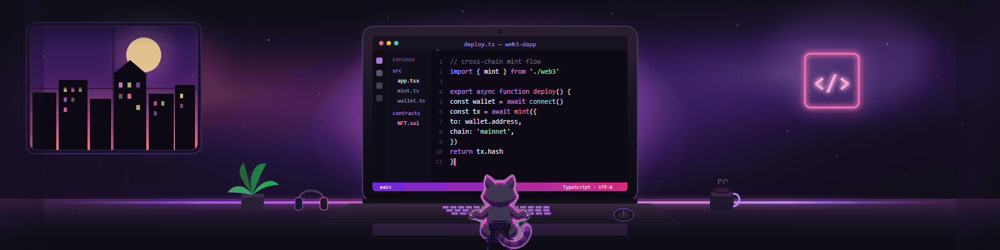
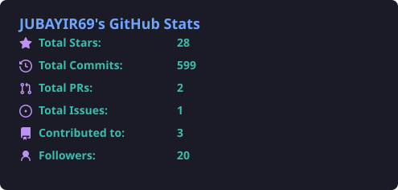
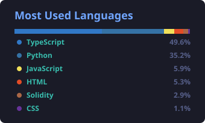
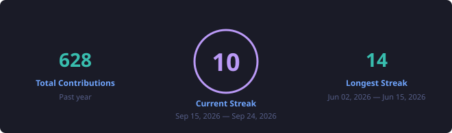

  

# 👋 Hi, I'm Jubayir Haider

  <em>Building Web3 ecosystems & decentralized communities from Dhaka, Bangladesh. 
  Experienced crypto professional shipping dApps, moderating communities, and growing Web3 brands.</em>

 

 

 

  

 

## 🚀 About Me

 

I'm **JUBAYIR69** — an experienced Web3 developer, community builder, and crypto marketer. I build decentralized applications across multiple networks using AI-assisted vibe coding. From moderating top-tier Discords to architecting cross-chain ecosystems, I am a **community-first builder**.

I also work as a Community Manager across projects — helping build, manage, and engage their communities through airdrop campaigns, ambassador support, contest creation, and day-to-day growth.

 

- 📍 Based in **Dhaka, Bangladesh**
- 💬 Open for collabs on [X](https://x.com/alr80171) and [Discord](https://discord.com/users/775330417414635530)

 

  

 

## 🛠️ What I Do

 

<table>
<tr>
<td width="8" bgcolor="#8B5CF6">&nbsp;</td>
<td>
 
01
<h3>💻&nbsp;&nbsp;Web3 Development</h3>

Production dApps, wallet flows, and cross-chain product surfaces with 
<strong>Grok Build</strong>, <strong>Codex</strong>, <strong>Claude</strong>, React, Next.js, and Solidity

<code>Grok Build</code>&nbsp;&nbsp;<code>Codex</code>&nbsp;&nbsp;<code>Claude</code>&nbsp;&nbsp;<code>React</code>&nbsp;&nbsp;<code>Next.js</code>&nbsp;&nbsp;<code>Solidity</code>

 
</td>
</tr>
</table>

<table>
<tr>
<td width="8" bgcolor="#EC4899">&nbsp;</td>
<td>
 
02
<h3>🛡️&nbsp;&nbsp;Community Moderation</h3>

Discord health for top-tier servers — keeping communities 
<strong>safe</strong>, <strong>organized</strong>, and <strong>high-signal</strong>

<code>Safe</code>&nbsp;&nbsp;<code>Organized</code>&nbsp;&nbsp;<code>High-signal</code>

 
</td>
</tr>
</table>

<table>
<tr>
<td width="8" bgcolor="#A78BFA">&nbsp;</td>
<td>
 
03
<h3>📣&nbsp;&nbsp;Crypto Marketing</h3>

Brand rep, ambassadorship, airdrop campaigns, 
contests, and ecosystem growth

<code>Brand Rep</code>&nbsp;&nbsp;<code>Ambassadorship</code>&nbsp;&nbsp;<code>Airdrops</code>&nbsp;&nbsp;<code>Contests</code>

 
</td>
</tr>
</table>

<table>
<tr>
<td width="8" bgcolor="#F472B6">&nbsp;</td>
<td>
 
04
<h3>🤝&nbsp;&nbsp;Community Management</h3>

Building, managing, and engaging communities around 
innovative Web3 projects

<code>Build</code>&nbsp;&nbsp;<code>Manage</code>&nbsp;&nbsp;<code>Engage</code>

 
</td>
</tr>
</table>

 

  

 

## 🧰 Tech Stack / Tools

 

  

 

  

 

## 📊 GitHub Stats

 

 

 

  

 

## 🌐 Connect With Me

 

  

**Open for collabs** — let's build the next Web3 ecosystem together.

 

  

