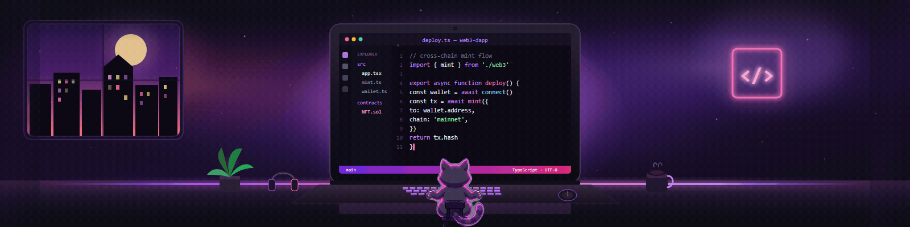
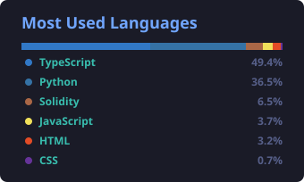
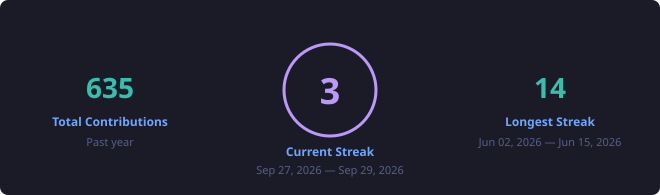

  

# 👋 Hi, I'm Jubayir Haider

  I build websites, web apps, dApps, and Telegram bots from Dhaka, Bangladesh.

 

 

  

 

## 🚀 About Me

 

I'm **Jubayir Haider**, a developer based in **Dhaka, Bangladesh**. I build websites, web apps, dApps, and Telegram bots, along with the small tools around them. On the Web3 side, that usually means wallet sign-in and the interface in front of a smart contract.

I also moderate Discord communities and help with day-to-day community management for projects I work with.

 

- 📍 **Dhaka, Bangladesh**
- 🤝 Open to freelance projects, collaborations, and remote roles

 

  

 

## 🛠️ What I Do

 

<table>
<tr>
<td width="8" bgcolor="#8B5CF6">&nbsp;</td>
<td>
 
01
<h3>💻&nbsp;&nbsp;Web Development</h3>

Company sites, portfolio sites, and web app interfaces.

<code>React</code>&nbsp;&nbsp;<code>Next.js</code>&nbsp;&nbsp;<code>TypeScript</code>

 
</td>
</tr>
</table>

<table>
<tr>
<td width="8" bgcolor="#EC4899">&nbsp;</td>
<td>
 
02
<h3>🔷&nbsp;&nbsp;Web3 Products</h3>

dApps with wallet sign-in, and the screens in front of a smart contract.

<code>Solidity</code>&nbsp;&nbsp;<code>React</code>&nbsp;&nbsp;<code>Next.js</code>

 
</td>
</tr>
</table>

<table>
<tr>
<td width="8" bgcolor="#A78BFA">&nbsp;</td>
<td>
 
03
<h3>🤖&nbsp;&nbsp;Bots & Automation</h3>

Telegram bots and small scripts that take repetitive work off a team's plate.

<code>Python</code>&nbsp;&nbsp;<code>Node.js</code>&nbsp;&nbsp;<code>Telegram</code>

 
</td>
</tr>
</table>

<table>
<tr>
<td width="8" bgcolor="#F472B6">&nbsp;</td>
<td>
 
04
<h3>🛡️&nbsp;&nbsp;Community Support</h3>

Discord moderation and day-to-day community management for projects I work with.

<code>Discord</code>&nbsp;&nbsp;<code>Moderation</code>

 
</td>
</tr>
</table>

 

  

 

## 🧰 Tech Stack / Tools

 

**Languages & frameworks**

 

  

**Workflow**

 

  

 

  

 

## 📊 GitHub Stats

 

  

 

  

 

## 🌐 Connect With Me

 

  

  

Open to freelance projects, collaborations, and remote roles. 
Email is the best way to start.

  

